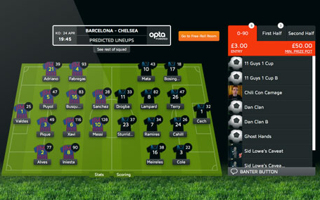
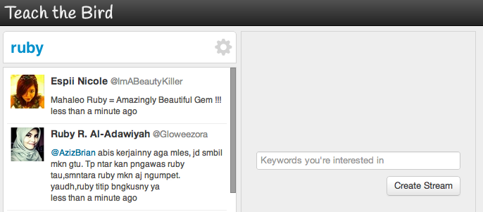

          
            
            
# Building Web apps with Backbone

          
          

          
            
            
# Hello
I'm @timruffles
We'll do an hour on Backbone, then do Q&A.
github.com/timruffles/backbone-ga-class
Example code up above - clone if you've `git`, or grab the
`.zip`.
I'll put the slides up later.
          
          

          
            
            
# Things I've done with Backbone
Real time games

Twitter client

Chrome extensions
          
          

          
            
            
# Backbone is
Backbone gives you:
- structure for your app
- 

- the boring bits of MVC written for you
- 

          
          

          
            
            
# What Backbone is not
- A DOM Library
- 

- An AJAX library
- 

- Big: ~1000, well documented, lines of code (read it)
- 

- Tied to jQuery (can use Zepto for mobile, Ender, whatever w/adapters)
- 

- A framework (Dojo, Ext.JS), AKA everything++
- 

          
          

          
            
            
# What we'll do

#
# Go over

- Bird's eye view of a Backbone app
- 

- Models
- 

- Views
- 

- Sync
- 

- Routing
- 

#
# With example code

          
          

          
            
            
# Backbone apps
Are primarily divided between `Models` and `Views`
Are primarily driven by events from the `Models` when they change
Handle all user interaction in their `Views`
          
          

          
            
            
# Bird's eye view
What you are doing for a user lives in your `Models`
How you interact with the user lives in `Views`
You talk to servers via `Backbone.sync`
You make your app feel like a website with `Router`
          
          

          
            
            
# Key terms
- Domain
- 

- Model
- 

- State
- 

          
          

          
            
            
# Domain
The 'problem' this app is solving for its users.
"a specified sphere of activity or knowledge"
Everything users care about - their current score, their bank balance.
All the rules, logic and constraints around this.
          
          

          
            
            
# Model
The representation of our domain in code.
          
          

          
            
            
# State
What has happened in the domain.
In the domain, you now have have 
- 500 points
- 

- or £500
- 

- or 500 friends.
- 

          
          

          
            
            
# What does Backbone do?
- Domain & state lives in Model
- 

- View present and allows user to interact state
- 

- Sync saves state
- 

- Router navigates state (for browser apps)
- 

          
          

          
            
            
# First up: Model aka Brain

          
          

          
            
            
# Models
Code handelling the real world processes your app represents or constitues.
          
          

          
            
            
# Our example app
Weight training planner.
Very simple domain - exercises are 1-20 sets of 1-20 reps.
Our `Model`
- sets attribute
- 

- reps attribute
- 

- validation: both present, both 1-20
- 

          
          

          
            
            
# Model
```
Exercise = Model.extend({
  url: function() {
    return "/exercise" + (this.isNew() ? "s" : "/" + this.id);
  },
  validate: function(attrs) {
    attrs.sets = parseInt(attrs.sets)
    attrs.reps = parseInt(attrs.reps)
    var errors = []
    if(attrs.sets > 20 || attrs.sets < 1) errors.push("sets must be between 1-20");
    if(attrs.reps > 20 || attrs.reps < 1) errors.push("reps must be between 1-20");
    if(errors.length > 0) {
      return "Exercise item invalid: " + errors.join(" and ") + ".";
    }
  }
});
```


          
          

          
            
            
# Get a lot for free
Didn't have to:
- specify fields (public var int sets, no thanks)
- 

- specify setters/getters
- 

          
          

          
            
            
# Key: get/set/on
```
model.set({sets:12,reps:12})
model.get("sets") // 12

model.on("change:sets",function(model,sets) {
  console.log("Sets changed to ",sets)
})
```


          
          

          
            
            
# Set, get and on - core of Model
Get/set gives us an encapusalted set of attributes.
We get notified whenever they change via `Backbone.Events`' `on` method.
```
model.on("change:SOMETHING",function(THE_MODEL,THE_NEW_VALUE) {
  /* do something */
  var previousValue = model.previous("SOMETHING");
})
```


          
          

          
            
            
# Previous
Give us access to previous value of a changed attribute in any `change`
callback.
Useful for dealing with transitions between state.
```
var previousValue = model.previous("SOMETHING");
```


          
          

          
            
            
# Knowledge of domain
Models are smart - here they know everything about what an exercise needs.
We don't want this knowledge anywhere else.
Model owns its state, and rules will always be applied when it wants them to.
          
          

          
            
            
# Example - validation
```
Exercise = Model.extend({
  validate: function(attrs) {
    attrs.sets = parseInt(attrs.sets)
    attrs.reps = parseInt(attrs.reps)
    var errors = []
    if(attrs.sets > 20 || attrs.sets < 1) errors.push("sets must be between 1-20");
    if(attrs.reps > 20 || attrs.reps < 1) errors.push("reps must be between 1-20");
    if(errors.length > 0) {
      return "Exercise item invalid: " + errors.join(" and ") + ".";
    }
  }
});
```


          
          

          
            
            
# SPOT
One place to define/enforce good states for exercise
Single point of truth - SPOT
```
exercise.set({sets:-10}) // will fail, no matter where it's called from
```


VS `non_mvc`, where we manually ensure modification
to model occurs with correct domain rules.
```
form.submit(function(evt) {
  var errors = validateExercise(data);
})
/* ... */
list.on("submit","form",function(evt) {
  var errors = validateExercise(data);
})
```


          
          

          
            
            
# Collections
Simple - a one or models.
Useful collection events: `add`, `remove`, `reset`.
Also delegates all model events:
```
exerciseList.on("change:sets",function(model,newValue,collection) {
  /* */
});
```


          
          

          
            
            
# Useful domain tasks
- Keep in a certain order: comparator on Model
- 

- Has all of underscore.js's great methods
-- You can include, shuffle, pluck, reduce (JS 1.8.x method).
- 

          
          

          
            
            
# Proactive - model drives the app
Drive your app by listening to events on your `Models` and
`Collections`.
```
model.on("error")
model.on("change:X")
model.on("domainSpecificEvent")

collection.on("add")
collection.on("remove")
collection.on("reset")
collection.on("ANY_MODEL_EVENT_DELEGATED")
```


          
          

          
            
            
# Model summary
- Hold all domain knowledge
- 

- Use events to react to changes in domain state
- 

- Validate method to keep our domain in good shape
- 

- Use collections to deal with >1 model
- 

          
          

          
            
            
# Next - the dumb view

          
          

          
            
            
# Views
The frontman - making noise, keeping users entertained.
Dumb - no domain knowledge, has to be told to do 
everything by the model.
Igor to model's Dr Frankestein, Pinky to Brain, George
Bush to Dick Chaney.
          
          

          
            
            
# Free goodies from Backbone
Don't faff around manually creating events, let Backbone do it for you:
```
ExerciseList = View.extend({
  // "EVENT SELECTOR(s)": "METHOD_NAME"
  events: {
    "click .remove": "remove",
    "submit #exercises form": "update",
    "submit": "create"
  }
})
```


Will create event delegation on the `View`'s `el`.
          
          

          
            
            
# El what?
`el` is to DOM element a view owns.
You pop a view into the DOM by putting the `el` into the DOM.
It is created with the view, before the `initialize` method is called.
          
          

          
            
            
# Events roundup
- Defined in events object
- 

- Bound before initialize via delegation
- 

- Therefore change the DOM inside as much as you like, just don't change el
- 

          
          

          
            
            
# Other boring bits you don't need to do
```
View.extend({
  id: "exercise-list", // id for el
  className: "panel mobile", // class names for el
  tagName: "ul" // type of element el will be, defaults to div
  attrs: { // attributes to set on el
    draggable: true
  }
})
```


          
          

          
            
            
# Other key bits
```
ExerciseList = View.extend({
  initialize: (options) {
    if(!this.model || !this.collection || !this.el) {
      throw "Never happens - all assigned for you already from options");
    }
    this.$el.fadeIn() // a pre-DOM-library-wrapped pointer to el
    this.$(".exercises") // and a selector with context preset to el
  }
})
new ExerciseList({
  model: user,
  collection: exercises
})
// no errors!
```


          
          

          
            
            
# Don't do and then
Don't do and then, do and rely on defined callbacks
Don't manipulate model state like:
```
team.addPlayer(player) // change state
this.render() // update view
```


Boo. What happens when someone else changes the domain in the same way?
We would still want the `View` or other code to react in the same way.
          
          

          
            
            
# Always listen to the model, it's smart
Smart models, dumb views, happy apps.
```
ExerciseList = View.extend({
  _.bindAll(this,"render","error");
  this.collection.bind("add remove reset change", this.render);
  this.collection.bind("error",this.error);
  this.render();
})
```


          
          

          
            
            
# View not limited to DOM
```
SpaceInvadersRenderer = View.extend({
  initialize: function() {
    _.bindAll(this,"render")
    this.ctx = this.el.getContext("2d");
    window.requestAnimationFrame(this.render);
  }
})
```


          
          

          
            
            
# Sound
```
Sound = View.extend({
  initialize: function(opts) {
    /* assignment */
    this.match.on("start",_.bind(this,this.play,"whistle"))
    this.events.on("foul",this.randomGroan)
    this.events.on("goal",this.randomCheer)
  }
})
```


          
          

          
            
            
# Logging
```
Logger = View.extend({
  initialize: function(opts) {
    /* assignment */
    this.user.on("all",this.userAudit)
    this.songs.on("all",this.songAudit)
  }
})
```


Logging is likely non-domain, makes sense to keep it as a 'view' of it instead.
          
          

          
            
            
# Templates
Easiest way to write DOM.
I'd recommend Mustache or other code-free templates.
Too much to go into depth.
Ideally load templates via `require.js` or similar, again too much to
discuss.
          
          

          
            
            
# Templates are easy
Very simple - I define:
A `transform` function that makes a JSON
representation of the `Views` model
A `render` function like that passes it to template
```
transform = function() {
  // an object
}
render = function() {
  this.el.innerHTML = Mustache.to_html(this.template,this.transform())
}
```


          
          

          
            
            
# View summary
- Dumb
- 

- Reactive - never update model and then
- 

- Use templates for DOM
- 

- Not tied to DOM - any non-domain representation of model
- 

          
          

          
            
            
# Sync
If we can't store the state of our domain, we don't really have much of an app.
          
          

          
            
            
# Backbone sync
```
Backbone.sync = function(method,model,options) {
  /* default REST implementation */
}
```


- One signature, many potential implementations.
- 

- Not limited to REST verbs - I've used keepUpdated for Pusher/Polling
- 

          
          

          
            
            
# Switch on context
```
Model.extend({
  sync: (method) {
    if(method == "keepUpdated") {
      Pusher.sync.apply(Pusher,arguments);
    } else {
      Backbone.sync.apply(Backbone,arguments);
    }
  }
})
```


          
          

          
            
            
# Overriding encouraged
Very simple to override - without legacy is ~10 lines of code.
Default is REST with all heavy lifting done by DOM library.
          
          

          
            
            
# Drives persistance of Model
```
model.fetch() // Backbone.sync("read",model,options)

// save method depends on model.isNew()
// Backbone.sync("create OR update",model,{success,error})
model.save({someUpdate:"toAttributes"},{
  success: function() ...
  error: function()..
})

// Backbone.sync("delete",model,options)
model.destroy()
```


          
          

          
            
            
# And Collection
```
// same as model.save() on new model
collection.create(attributes,{
  wait: true // don't add to collection till server OKs
})

// Backbone.sync("read",collection,options)
collection.fetch()
```


          
          

          
            
            
# Sync summary
- Keep all persistance implementation here
- 

- Implementation behind Model's persistance methods
- 

- REST implementation free, easy to implement yourself
- 

- Inspiringly simple piece of API design - like lego
- 

          
          

          
            
            
# Routing
Triggers callbacks when URL matches certain patterns.
Can extract paramters from URL via `:paramName` in routes
Converted to regex internally
```
 var AppRouter = Backbone.Router.extend({
    routes: {
      "": "list",
      "exercises/:id": "show"
    },
    list: function() {
    },
    show: function(id) {
    }
  });

  var router = new AppRouter()
  Backbone.history.start({pushState:true});
```


          
          

          
            
            
# Role of router
If there's a chance you'll go mobile etc, might be wise to avoid
overdependence on router
One pattern I've used is an App `ViewModel` - simply using a model to
represent the state of your view.
With `ViewModel` pattern, `Router` is one input to view state - commands
or loaded data could be another
          
          

          
            
            
# Router summary
- Simple routing via hashChange or pushState
- 

- Routes urls and fires callbacks, with extracted params
- 

- Consider use case
- 

          
          

          
            
            
# Backbone roundup
What you are doing for a user lives in your `Models`
How you interact with the user lives in `Views`
You talk to servers via `Backbone.sync`
You make your app feel like a website with `Router`
          
          

          
            
            
# Question time
@timruffles
truffles.me.uk - about to run a series on Backbone
testing
          
          
